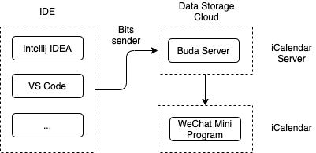
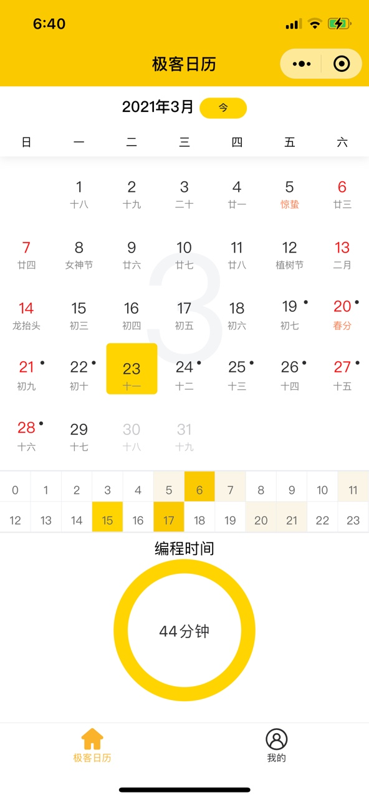

# iCalendar
iCalendar 中文名「i极客日历」，一个专门为**程度员**定制的日历小程序。

其主要有两大核心能力：
1）记录并追踪自己的编程时间；
2）日程安排及日历查看。微信扫描二维码：

## 整体框架
主要分为两部分：

1）在IDE中通过插件进行打点上报，使用IDE的插件（见插件支持部分）进行打点，然后上报到远端服务器。注意：不会上报具体的详情信息，只会上报编程的时间点信息，请放心使用。  

2）「i极客日历」微信小程序展示，通过拉取服务端数据进行展示。

下图显示了整体的数据流程：

## 小程序效果图

## 使用说明  

1. 在「i极客日历」微信小程序中申请帐号：我的->帐号信息->申请帐号；   
2. 在IDE中安装WebX插件，如何安装见[WebX](https://github.com/aborn/WebX)；  
3. 在IDE中配置用户id和token信息。  

## IDE支持说明
手动安装IDE插件可从 plugins 目录下载打包好的插件文件（请使用最新版本）：
### Intellij IDEA
使用Intellij IDEA开发，需要手动安装[WebX](https://github.com/aborn/WebX)插件。  

### VS Code
使用VS Code开发，需要手动安装[iCalendar](https://github.com/aborn/iCalendar/tree/main/icalendar-vscode)插件。

## 版本功能

- [x] 1. 支持IDE：Intellij IDEA和VS Code；  
- [x] 2. 日历基础功能（查看编程足迹）；  
- [x] 3. 用户id和token设置；    
- [x] 4. 支持阳历、农历、节假日信息；

## 待开发的版本功能  

- [ ] 1. 支持编程排行榜
- [ ] 2. 展示年度总编程时间和编程天数
- [ ] 3. 特殊日期可配置
- [ ] 4. iCalendar组件化

## 支持该项目
该项目需要服务器支持，你的捐赠将用于支付服务器费用。

  

