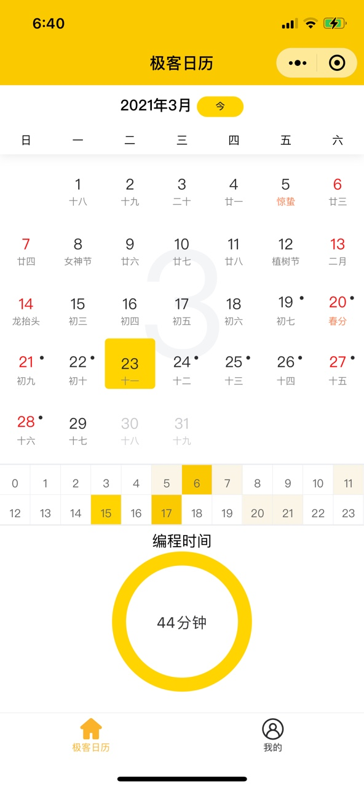

# iCalendar
iCalendar --「i极客日历」微信小程序，查看自己的编程足迹（通过WebX插件记录编程时间）。微信扫描二维码：

## 效果图

## 使用说明  

1. 在IDE中安装WebX插件，如何安装见[WebX](https://github.com/aborn/WebX)  
2. 发邮件到aborn#aborn.me注册用户token信息（id为你的GitHub id，将#换成@）    
> **i) 申请邮件标题为：注册极客日历用户+GitHub id**  
> **ii) 前期开放100个免费注册名额（先到先得）**
3. 在IDE及小程序中配置用户id和token信息  

## V1.0版本功能

- [x] 1. 支持IDE：Intellij IDEA；  
- [x] 2. 日历基础功能（查看编程足迹）；  
- [x] 3. 用户id和token设置。  

## 待开发的版本功能  

- [] 1. 支付排行榜
- [] 2. 展示年度总编程时间和编程天数
- [] 3. 特殊日期可配置
- [] 4. 支持 IDE：VS Code
- [] 5. iCalendar组件化

## 支持该项目
该项目需要服务器支持，你的捐赠将用于支付服务器费用。

  

