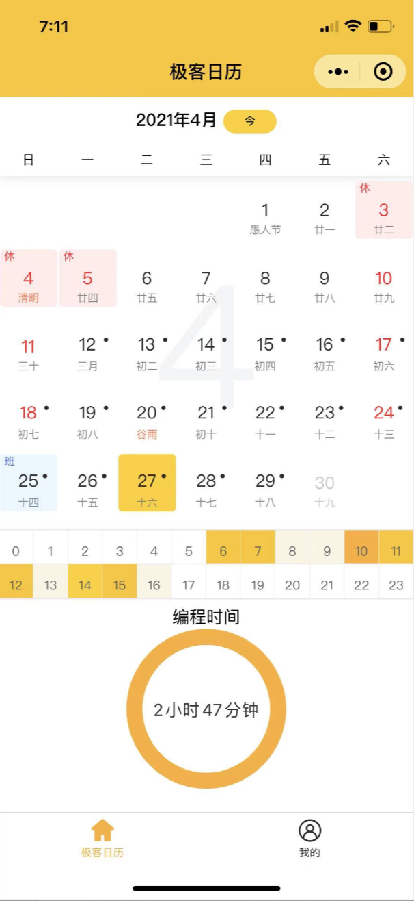

# iCalendar

iCalendar (极客日历, Chinese) is a powerful extension for tracing your code time and make your plan.  

## Features

This extension records your each code behaive, but will not record which file you have opened and file's content. Your code time record will post to remote server.   

You can view your code time via WeChat mini-program「i极客日历」, preview as follows:  

## Usage

Config this extension as following steps:  

* Register your account in WeChat mini-program「i极客日历」.   
* Config your token and id : command 'iCalendar: Config Token' and 'iCalendar: Config ID'.    

After finished, your can view your code time in WeChat mini-program「i极客日历」.  

## Release Notes
### 1.0.0

1. Initial release of iCalendar.  
2. Code Time tracing and report.  
3. User token and id config.  

**Enjoy happy coding!**
